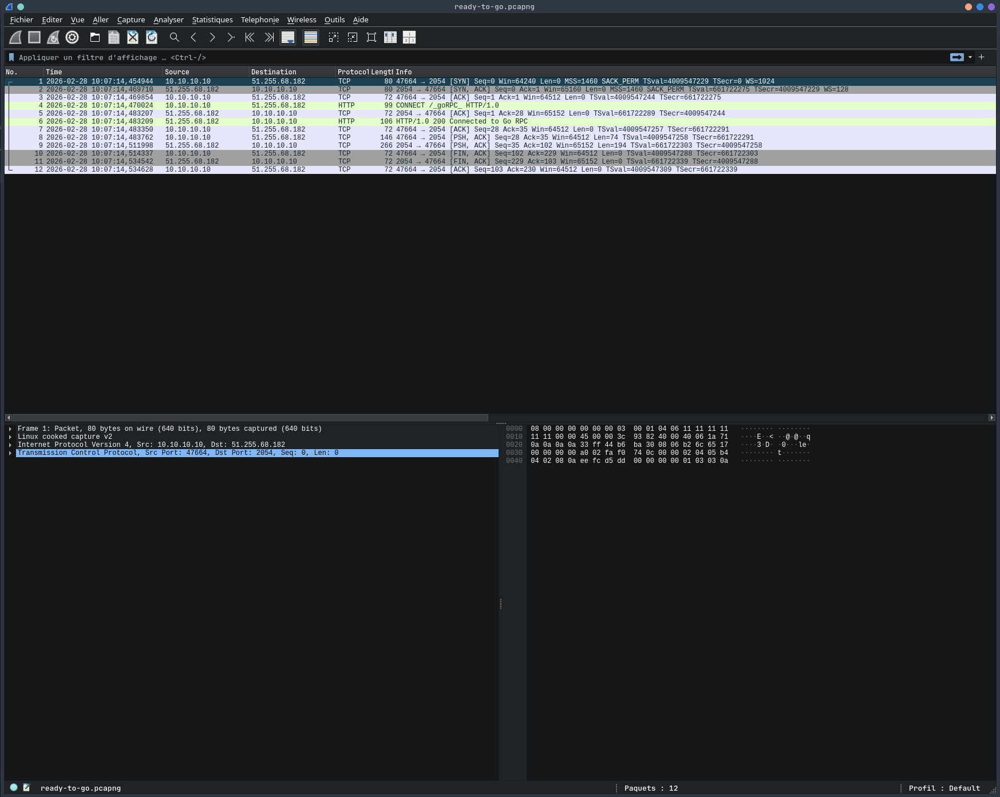

# FCSC 2026 - Ready to GO

|catégorie|partie|difficulté|
|:----:|:----:|:----:|
|MISC|1|2 étoiles|

## Is it a yes or a no ? (mandatory Martin Solveig tribute !)

>Nous avons identifié un flux réseau qui contient un protocole propriétaire inconnu. Arriverez-vous à comprendre l'application qui est derrière ?  

Un fichier pcapng, et rien de plus, une information sur un protocole proprio. Je sens que je vais le regretter, mais allons-y !

Comme d'habitude, une petite lecture rapide avec la GUI de wireshark pour avoir une petite idée du démon auquel je vais faire face, et pour une fois, il ne semble pas si terrifiant que cela

  

en regardant dans les streams, on voit que le stream tcp 0 nous donnes quelques information dont l'architecture du serveur distant

```
CONNECT /_goRPC_ HTTP/1.0

HTTP/1.0 200 Connected to Go RPC

Request
ServiceMethod Seq FileHandler.List .
Response
ServiceMethod Seq Error FileHandler.List
DirEntry 
Name Type 
flag D
go.mod F
ready-to-go F
server.go F
```

On sait qu'il faut faire un **CONNECT** pour interagir avec le serveur, qu'il existe une méthon FileHandler.List qui va server à lister les fichiers/dossiers présent (listé *F* ou *D* après le nom), et que l'on va avoir une structure DirEntry décrit comme suivant:

```go
type DirEntry struct {
    Name string
    Type string
}
```

dans le retour qui nous est donné, on voit le dossier **flag**, ce qui est bon signe, mais connaissant nos amis du FCSC, ça ne sera pas aussi simple de récupérer le précieux !  

Mais le plus important surtout, c'est que l'on a une petite idée de ce que nous allons devoir réaliser. Nous allons chercher dans le dossier flag un fichier qui sera certainement nommé flag.txt, Easy non ?


Mais quelle horreur le grpc ! on ne peux pas lister en netcat (ou je n'ai pas trouvé comment bien le faire), ni utiliser python, obliger de passer par un script en GO ! Qu'a cela ne tienne ! on va faire le srcipt en GO

mais on va arriver à un point frustrant  


OK, on arrive à lister, mais comment on fait pour lire le fichier ??

Je ne vous cache pas, j'ai testé FileHandler.Read, FileHandler.Cat et autres itération avant de trouver FileHandler.Get. Par contre il remonte une liste de Bytes, un peu de recherche sur internet pour voir qu'il faut juste faire un string(contenu_du_fichier) et il passe les bytes en ascii.

```go
package main

import (
	"fmt"
	"log"
	"net"
	"net/rpc"
	"strings"
	"time"
)

type DirEntry struct {
	Name string
	Type string
}

func main() {
	
	conn, err := net.Dial("tcp", "challenges.fcsc.fr:2054")
	if err != nil {
		log.Fatal(err)
	}
	defer conn.Close()

	conn.SetDeadline(time.Now().Add(15 * time.Second))
	

	// CONNECT
	fmt.Fprintf(conn, "CONNECT /_goRPC_ HTTP/1.0\r\n\r\n")

	buf := make([]byte, 1024)
	n, _ := conn.Read(buf)
	if err !=nil {
		log.Fatal(err)
	}

	if !strings.Contains(string(buf[:n]), "200") {
		log.Fatal("CONNECT failed")
	} else { fmt.Println("[!] Woot-Woot, nous sommes connecté !") }

	client := rpc.NewClient(conn)

	fmt.Println("[+] Exploration...")

	//call la variable findFLag avec les paramètres client [pour la connection] et "flag" car on sait avec le dump que c'est le répertoire de départ.
	findFlag(client, "/flag")
}

func findFlag(client *rpc.Client, path string) {
	//Sert a avoir un retour dans la console quand il scan l'arborescence
	//fmt.Println("[+] Listing:", path)

	var entries []DirEntry
	err := client.Call("FileHandler.List", path, &entries)
	//kill le prog si une erreur est rencontrée
	if err != nil {
		log.Fatal(err)
	}

	//Sert a avoir un retour dans la console quand il scan l'arborescence
	//fmt.Println("[+]Listing :", entries)

	for _, e := range entries {
		fullPath := path + "/" + e.Name

		if e.Type == "D" {
			findFlag(client, fullPath)
		} else {
			fmt.Println("[+] Fichier trouvé:", fullPath)

			// tenter de lire le fichier trouvé
			var content []byte
			err := client.Call("FileHandler.Get", fullPath, &content)
			if err == nil && len(content) > 0 {
				fmt.Println("[!] FLAG:\t",string(content))
				return
			}
		}
	}
}
```

avec ça, il n'y a plus qu'a lancer le script

```shell
>go run exploit.go
[!] Woot-Woot, nous sommes connecté !
[+] Exploration...
[+] Fichier trouvé: /flag/4/8/3/2/b/b/b/6/a/c/2/1/a/5/7/6/2/5/1/6/f/4/0/7/f/0/5/c/3/4/7/f/7/0/e/f/9/1/d/4/e/9/a/b/1/0/7/9/e/0/8/7/a/e/b/5/6/a/b/b/7/a/b/d/flag.txt
[!] FLAG:	 FCSC{c0ced346ab8a4d376798d7a4f8870380fcd098c88599eaf92b5140faf216ef99}
```

et un nouveau flag de tombé après plusieurs jours de recherche et de turpitude !
